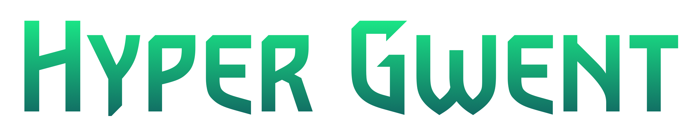
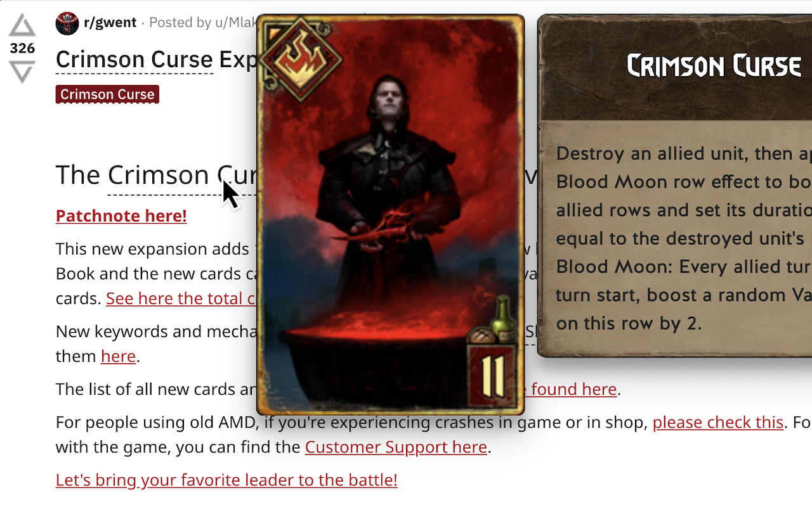

<h1 align="center">DEPRECATED</h1>

<h1 align="center"></h1>
<h4 align="center">Browser extension to preview cards on pages containing GwentⓇ related content.</h4>
<p align="center"><i>This is an unofficial fan work under the Gwent Fan Content Guidelines. Not approved/endorsed by CD PROJEKT RED</i></p>

Hyper Gwent is a browser extension for Chrome and Firefox, which can detect Gwent card names in the page you visit. Hovering any card name shows the card art and description.

The extension is fast. It is tolerant and tries to match plurals, inexact spellings ("ciri dash" instead of "Ciri: Dash"), and even common appellation for cards ("ADC", "gigni" etc.). And you can also choose on which sites the extension should run.



---

## Suggesting alternatives for card names

You can suggest new alternate names for cards. Here is the [complete list](https://github.com/Soreine/hyper-gwent/blob/master/core/data/static/ALIASES.js)

These include:

- Acronyms such as "ADC"
- Abbreviations such as "gigni"
- Incomplete names such as "fringilla".

The following don't need to be in this list though:

- Alternate case. For example "cIrI DASH" is automatically handled.
- Plurals. For example "QGs" for Queensguard and "dun banner light cavalries" are automatically handled.
- Alternate accentuation. For example "Schirru" is automatically recognized as Schirrú.
- Missing colons `:`, dashes `-`, apostrophes `'` are handled as well.

## Installation

1. [Install Node.js](https://nodejs.org/) version 10 or more
2. Install yarn: `npm install yarn --global`

Now, run the following commands to generate the extension code from the sources:

```
cd hyper-gwent/
yarn install
```

## Running the website

You can run the website locally (which includes the extension code running in the page):

```
yarn run start
```

And visit [localhost:8080](localhost:8080)


## Build

Build the cards data, the website files, and the extension files for Chrome and Firefox using

```
yarn run build
```

The generated extension code is now available in `dist/chrome` and `dist/firefox`.
You can load the unpacked extension for development in Chrome.

If you need to package the extension for publishing, or testing under Firefox:

```
yarn run pack
```

The resulting archive can be found in `chrome-build/hyper-gwent.zip` and `firefox-build/hyper-gwent.zip`

## Updating cards

After every Gwent patch release, the cards data need to be updated. Here's how:

- Upgrade to the latest version of `gwent-data-release`. You must use the master's commit SHA as dependency. Run `yarn`.
- `yarn run test` and fix any issues: missing new cards in `ALIASES.js`, or name conflicts because of new card names. Until `yarn run test` passes.
- Bump the `minor` field of `VERSION.js`. Since it's just a data update, the new data should work with the current builds of the extension, so it's a minor version.
- Commit the changes.
- `yarn run deploy` to deploy the new data.

## Releasing a new extension version

To release a new version:

- Make sure all tests pass `yarn run test`.
- Determine the new version number (using SEMVER) and update `CHANGELOG.md`
- Set the new version in `manifest.json`
- Build `yarn run build` and test extensions locally (Chrome and Firefox).
- Release on Chrome (ask @Soreine)
  - `yarn run pack`
  - Upload `chrome-build/hyper_gwent-x.zip` to the Chrome Web Store.
- Release on Firefox (ask @Zhouzi)
  - `yarn run pack`
  - Generate an archive of the source code by running `./scripts/zipSourceCode.sh`.
  - Upload `firefox-build/hyper_gwent-x.zip` and the source code `dist/hyper-gwent-source.tar.gz` to the Firefox store.
